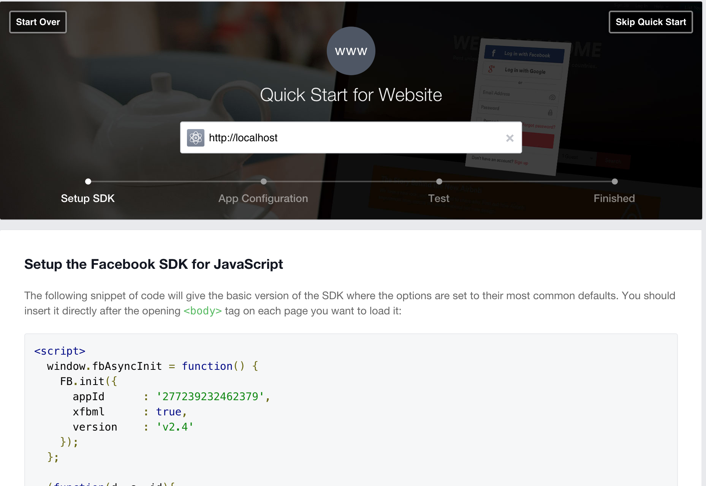

#Oauth with Facebook

###Getting started

	$ express facebook-login
	$ cd facebook-login
	$ npm install
	$ npm install -S dotenv express-session mongoose passport passport-facebook
	$ mkdir models config
	$ touch models/User.js config/facebook.js .env 
	$ echo ".gitignore\n.env" > .gitignore

####Getting Facebook App Id and Secret

- Go to this link: [Facebook Dev Console](https://developers.facebook.com/)


- Hover over `My Apps` and click `Add a New App`

- Choose `www` for `Website`



- Add http://localhost to the main input

- Set the `site URL` to `http://localhost:3000/auth/facebook/callback`

Add the Facebook ID and Secret to the .env file

```

FACEBOOK_APP_ID=2772392324****9
FACEBOOK_APP_SECRET=7729ac80d9b336e4287ccb700e****da
SECRET=HELLOWORLD

```

In your `config/facebook`

```
require('dotenv').load();

var passport = require('passport'),
    FacebookStrategy = require('passport-facebook').Strategy,
    Social = require('../models/Social'),
    User = require('../models/User');

passport.use(new FacebookStrategy({
    clientID: process.env.FACEBOOK_APP_ID,
    clientSecret: process.env.FACEBOOK_APP_SECRET,
    callbackURL: "http://localhost:3000/auth/facebook/callback"
  },
  function(accessToken, refreshToken, profile, done) {
      console.log(profile);     
      done(null, profile);
  }
));

module.exports = passport;
```

In your `index.js`

```
var express = require('express');
var router = express.Router();
var passport = require('passport');

/* GET home page. */
router.get('/home', isLoggedIn, function(req, res, next) {
    
  res.render('index', { title: 'Express', user: req.user });
});

// Log in
router.get('/login', function(request, response, next){
    response.render('login', {title: 'Log in'});
});

router.get('/logout', function(request, response, next){
    request.logout();
    response.redirect('/login');
});

// Facebook routes
router.get('/auth/facebook', passport.authenticate('facebook', {scope: ['email', 'user_birthday', 'user_location']}));

router.get('/auth/facebook/callback', passport.authenticate('facebook', {successRedirect: '/home', failureRedirect: '/login'}));

function isLoggedIn(request, response, next){
    if(request.isAuthenticated()){return next();}
    response.redirect('/login');
}

module.exports = router;
```

In your `app.js`


```
require('dotenv').load();
var express = require('express');
var path = require('path');
var favicon = require('serve-favicon');
var logger = require('morgan');
var cookieParser = require('cookie-parser');
var bodyParser = require('body-parser');
// ADD THESE
var passport = require('passport');
var mongoose = require('mongoose');
var session = require('express-session');

// Connect mongoose
mongoose.connect('mongodb://localhost/passport_facebook');

// Bring in facebook
var Facebook = require('./config/facebook');


var routes = require('./routes/index');
var users = require('./routes/users');

passport.serializeUser(function(user, done){
    done(null, user);
});

passport.deserializeUser(function(user, done){
    done(null, user);
});


var app = express();

// view engine setup
app.set('views', path.join(__dirname, 'views'));
app.set('view engine', 'jade');

// uncomment after placing your favicon in /public
//app.use(favicon(__dirname + '/public/favicon.ico'));
app.use(logger('dev'));
app.use(bodyParser.json());
app.use(bodyParser.urlencoded({ extended: false }));
app.use(cookieParser());
// Initialize passport and start the session
app.use(session({secret: process.env.SECRET}));
app.use(passport.initialize());
app.use(passport.session());
app.use(express.static(path.join(__dirname, 'public')));

app.use('/', routes);
app.use('/users', users);

// catch 404 and forward to error handler
app.use(function(req, res, next) {
  var err = new Error('Not Found');
  err.status = 404;
  next(err);
});

// error handlers

// development error handler
// will print stacktrace
if (app.get('env') === 'development') {
  app.use(function(err, req, res, next) {
    res.status(err.status || 500);
    res.render('error', {
      message: err.message,
      error: err
    });
  });
}

// production error handler
// no stacktraces leaked to user
app.use(function(err, req, res, next) {
  res.status(err.status || 500);
  res.render('error', {
    message: err.message,
    error: {}
  });
});


module.exports = app;

```

###Create a `login.jade`

```

extends layout

block content
    h1= title
    a(href='/auth/facebook') Login with Facebook
```

In your `index.jade`


```
extends layout

block content
  h1= title
  a(href='./logout') Logout
  p= user._json.id
  p= user._json.birthday
  p= user._json.email
  p= user._json.name
  p= user._json.gender
  a(href=user._json.link) My Facebook
  p= user._json.location.name
```


###You have a working Facebook OAuth!
